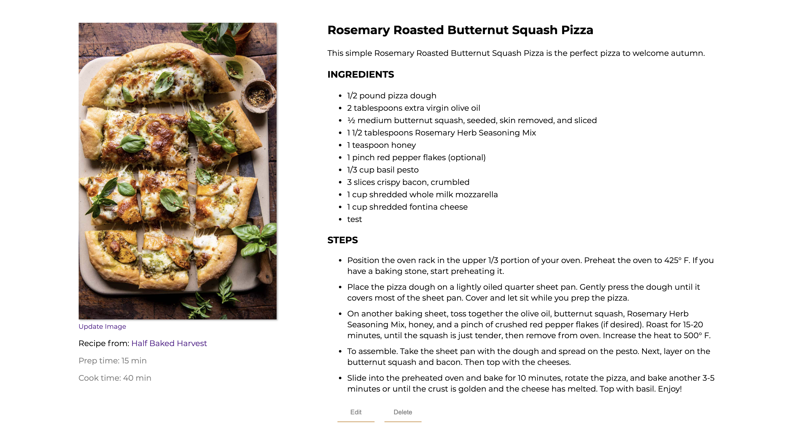
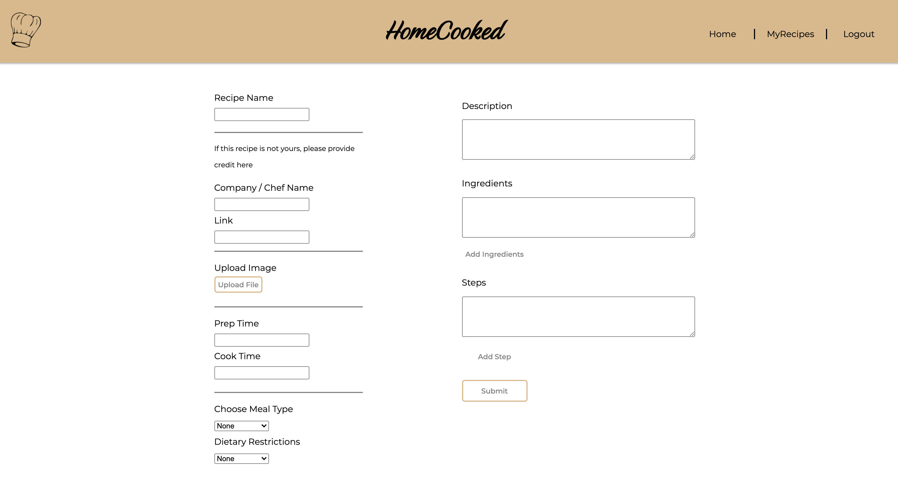

# HomeCooked

HomeCooked is a fully functional CRUD application created with Node.js.  It allows users to view a variety of different recipes as well as add / edit recipes of their own.  The application includes authentication and authorization.  It also allows users to upload and replace images for their 'MyRecipes' tab.

# Technologies Used

- Node.js
- Express
- JavaScript
- jQuery
- CSS
- Mongodb
- Cloudinary
- EJS

# Screenshots

# Getting Started

[Click here](https://homecooked99675.herokuapp.com/login) to see the deployed project

# Future Enhancements
- Giving the user more category options
- Users can interact with eachother and save recipes on a seperate tab
- Users can 'like' and comment on recipes